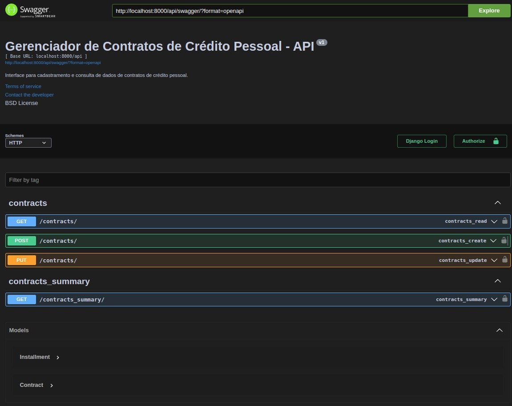

# Gerenciador de Contratos de Crédito Pessoal - API

Este repositório contém a impletamentação de uma API para gerenciamento de contratos de crédito pessoal.
O GCCP-API foi desenvolvido em Django Rest Framework e configurado para ser executado com Docker Compose.
Testes Unitários são construídos e executados na execução da imagem docker com Django Tests.
Nos seus recursos, incluem-se Django Superuser Admin e Swagger como gerenciamento de dados e documentação da API.

## Objetivo

O projeto visa atender aos requisitos demandados pelo [**test case**](doc/CASE_DESENVOLVEDOR_BACKEND.pdf) proposto pela [**Guardian Gestora**](https://www.guardian-asset.com//).

## Sumário

- [**Descrição do Projeto**](#gerenciador-de-contratos-de-crédito-pessoal---api)
- [**Estrutura do Projeto**](#estrutura-do-projeto)
- [**Pré-requisitos**](#pré-requisitos)
- [**Instalação**](#instalação)
  - [**Como Instalar o Docker e Docker Compose**](#como-instalar-o-docker-e-docker-compose)
- [**Construção e Execução**](#construção-e-execução)
- [**GCCP-API**](#gccp-api)
  - [**Descrição da API**](#descrição-da-api)
  - [**Diagrama de relação de entidade das tabelas**](#diagrama-de-relação-de-entidade-das-tabelas)
  - [**Endpoints Suportados pela API**](#endpoints-suportados-pela-api)
  - [**Utilizando Endpoints**](#utilizando-endpoints)
    - [**/contracts**](#contracts)
    - [**/contracts_summary**](#contracts_summary)
  - [**Recursos de Documentação da API**](#recursos-de-documentação-da-api)
    - [**Django Superuser Admin**](#django-super-user)
    - [**Swagger**](#swagger)
    - [**Swagger Redoc**](#swagger-redoc)
- [**Testes Unitários**](#testes-unitários)
- [**Observações Finais**](#observações-finais)

## Estrutura do Projeto

- [**doc/**](doc/): Pasta com arquivos de documentação do projeto.
- [**gccp_api_rest**](gccp_api_rest/): Pasta contendo a implementação do GCCP-API Rest app.
- [**gccp_api_root**](gccp_api_rest/): Pasta raiz do Django project com o gerenciamento de apps e pacotes.
- [**.env**](.env): Arquivo de exemplo para definição de variáveis de ambiente.
- [**.gitignore**](.gitignore): Lista arquivos não considerados no versionamento do projeto.
- [**Dockerfile**](Dockerfile): Definição do ambiente Docker.
- [**LICENSE**](LICENSE): tipo de licença atribuída ao projeto.
- [**README.MD**](README.md): Arquivo de documentação e informações gerais.
- [**docker-compose.yml**](docker-compose.yml): Arquivo de configuração do container Docker.
- [**docker-entrypoint.sh**](docker-entrypoint.sh): Script para setup inicial de execução do container Docker.
- [**manage.py**](manage.py): Arquivo principal do Django project que consolida a gestão de apps e pacotes.
- [**poetry.lock**](poetry.lock): Gerado pelo Poetry para coesão de dependências.
- [**pyproject.toml**](pyproject.toml): Arquivo de configurações do Poetry.
- [**requirements.txt**](requirements.txt): Arquivo gerado pelo Django que lista os pacotes que o projeto depende.

## Pré-requisitos
	
- **Docker** : instalação do repositório Docker como requisito para instalação do Docker Compose.
- **Docker Compose** : instalação do repositório Docker Compose para construção e execução da imagem do projeto.

## Instalação

### Como Instalar o Docker e Docker Compose

1.  **Download do Docker e Docker Compose**
     
    Caso você esteja usando Windows ou macOS você deve baixar o instalador do Docker Desktop no [site oficial do Docker Desktop](https://www.docker.com/products/docker-desktop/) e seguir as instruções da instalação.
    
    No linux, certifique-se de que o seu repositório de pacotes esteja atualizado:
    ```sh
      sudo apt update
	```
2.  **Instalar o Docker**

	Instale o Docker e Docker Compose usando os seguintes comandos:	
	```sh
    sudo apt install docker.io -y
    sudo apt install docker-compose-plugin -y
	```
3.  **Iniciar e Ativar o Docker**
	
	Inicie o serviço do Docker e ative-o para iniciar automaticamente na inicialização:
	```sh
    sudo systemctl enable --now docker
	```
4.  **Verificar a Instalação**
	
	Confirme as instalações:
	```sh
    docker --version
    docker compose version
    ```

## Construção e Execução

### Como gerar e executar imagem Docker

1. **Gerar imagem Docker**

	Para construir e executar a imagem docker utilize o comando:
    ```sh
    sudo docker compose up --build
    ```
   Com o contâiner em operação, você tem acesso ao GCCP-API pelo endereço [**0.0.0.0:8000**](http://0.0.0.0:8000).


2. **Rebuild de imagem docker (em caso de erro)**

    Caso haja algum erro na construção e/ou execução da imagem, é póssivel parar e remover o container executando:
    ```sh
    docker-compose down --volumes --remove-orphans
    ```
   Em seguida, podendo ser construído e executado novamente com o comando do passo 1.
    

## GCCP-API
	
### Descrição da API

O GCCP-API gerencia dados de contrato de crédito pessoal, como os dados do contrato e do seu tomador, bem como o detalhamento de parcelas para pagamento.

**Tabelas:**
	
- ``Contracts``: Detalha os dados do contrato de crédito pessoal. Seu campos são:
    - `id`: ID autogerado do Contrato de Crédito Pessoal (CCP), sendo sua chave primária.
    - `issue_date`: Data de emissão do contrato.
    - `borrower_birth_date`: Data de nascimento do tomador.
    - `disbursed_amount`: Valor desembolsado pela instituição credora.
    - `document_number`: Número de documento do tomador (CPF).
    - `country`: País do tomador.
    - `state`: Estado do tomador.
    - `city`: Cidade do tomador.
    - `phone_number`: Número de contato do tomador.
    - `interest_rate`: Taxa de juros do contrato.
    - `installments`: Lista ordenada de Parcelas(Installment's).


- ``Installment``: Detalha os dados da parcela de pagamento:
    - `id`: ID autogerado de identificação da parcela no banco de dados.
    - `installment_number`: Número de ordem da parcela.
    - `amount`: Valor da parcela.
    - `borrower_birth_date`: Data de nascimento do tomador.
    - `due_date`: Data de vencimento da parcela.
    - `document_number`: Número de documento do tomador (CPF).
    - `contract`: Contrato referente a parcela. Sendo uma chave estrangeira ligada a ID do contrato.

### Diagrama de relação de entidade das tabelas:


### Endpoints Suportados pela API
- http://0.0.0.0:8000/api/contracts - **Interface de Operações de Contratos de Crédito Pessoal.**
- http://0.0.0.0:8000/api/contracts_summary - **Interface para resumo de dados consolidados de Contratos de Crédito Pessoal.**
- [http://0.0.0.0:8000/api/swagger](#swagger) - **Documentação do Swagger**
- http://0.0.0.0:8000/api/redoc - **Documentação de Rotas do Swagger**
- [http://0.0.0.0:8000/admin](#django-super-user) - **Django Superuser Admin**

### Utilizando Endpoints

- ### /contracts
    
  **Recursos de Entrada de dados:**
  - Criação e atualização de dados via corpo da requisição.
  - Suporte a atualização parcial de dados.
  
  **Recursos de Recuperação de dados:**
    - Suporte a parâmetros de consulta de dados. 
    - Parâmetros de consulta suportados:
      - id
      - document_number
      - issue_date
      - state

  #### Entrada de dados:
  - Método de requisição `POST`:
    - Examplo de corpo de requisição:
      ```json
      {
        "issue_date": "2025-01-15",
        "borrower_birth_date": "1995-01-01",
        "disbursed_amount": "15000.00",
        "document_number": "11122233344",
        "country": "Brasil",
        "state": "MG",
        "city": "Belo Horizonte",
        "phone_number": "31999999999",
        "interest_rate": "1.8",
        "installments": [
        {
          "installment_number": 1,
          "amount": "15000.00",
          "due_date": "2025-04-15"
        },
        {
          "installment_number": 2,
          "amount": "15000.00",
          "due_date": "2025-05-15"
        }]
      }
      ```
    - Exemplo de corpo de Resposta (201 - Created):
      ```json
      {
        "id": "CCP-AC8B0490",
        "issue_date": "2025-01-15",
        "borrower_birth_date": "1995-01-01",
        "disbursed_amount": "15000.00",
        "document_number": "11122233344",
        "country": "Brasil",
        "state": "MG",
        "city": "Belo Horizonte",
        "phone_number": "31999999999",
        "interest_rate": "1.80",
        "installments": [
          {
            "installment_number": 1,
            "amount": "15000.00",
            "due_date": "2025-04-15"
          },
          {
            "installment_number": 2,
            "amount": "15000.00",
            "due_date": "2025-05-15"
          }
        ]
      }
      ```
  - Método de requisição `PUT`:
    - Examplo de corpo de requisição:
      ```json
      {
          "id": "CCP-AC8B0490",
          "disbursed_amount": "12000.00",
          "interest_rate": "1.8",
          "state": "MG"
      }
      ```
    - Exemplo de corpo de Resposta (200 - Ok):
      ```json
      {
            "id": "CCP-AC8B0490",
            "issue_date": "2025-01-15",
            "borrower_birth_date": "1995-01-01",
            "disbursed_amount": "12000.00",
            "document_number": "11122233344",
            "country": "Brasil",
            "state": "MG",
            "city": "Belo Horizonte",
            "phone_number": "31999999999",
            "interest_rate": "1.80",
            "installments": [
              {
                "installment_number": 1,
                "amount": "15000.00",
                "due_date": "2025-04-15"
              },
              {
                "installment_number": 2,
                "amount": "15000.00",
                "due_date": "2025-05-15"
              }
            ]
      }
      ```
  #### Recuperação de dados:
    - Método de requisição `GET`:
      - Exemplo de consulta URL com parâmetros:
      
      `http://0.0.0.0:8000/api/contracts/?state=MG&issue_date=2025-01-15`
      - Exemplo de corpo de Resposta (200 - Ok):
          ```json
          [
              {
                "id": "CCP-AC8B0490",
                "issue_date": "2025-01-15",
                "borrower_birth_date": "1995-01-01",
                "disbursed_amount": "12000.00",
                "document_number": "11122233344",
                "country": "Brasil",
                "state": "MG",
                "city": "Belo Horizonte",
                "phone_number": "31999999999",
                "interest_rate": "1.80",
                "installments": [
                    {
                        "installment_number": 1,
                        "amount": "15000.00",
                        "due_date": "2025-04-15"
                    },
                    {
                        "installment_number": 2,
                        "amount": "15000.00",
                        "due_date": "2025-05-15"
                    }
                ]
              },
              {
                "id": "CCP-0975AEFF",
                "issue_date": "2025-01-15",
                "borrower_birth_date": "1997-02-01",
                "disbursed_amount": "45000.00",
                "document_number": "21122233344",
                "country": "Brasil",
                "state": "MG",
                "city": "Betim",
                "phone_number": "31999999999",
                "interest_rate": "1.50",
                "installments": [
                    {
                        "installment_number": 1,
                        "amount": "27000.00",
                        "due_date": "2025-04-12"
                    },
                    {
                        "installment_number": 2,
                        "amount": "27000.00",
                        "due_date": "2025-05-13"
                    }
                ]
              }
          ]
         ```

- ### /contracts_summary
    
  **Recursos de Recuperação de dados:**
    - Suporte a parâmetros de consulta de dados para resumo de dados consolidados. 
    - Parâmetros de consulta suportados:
      - id
      - document_number
      - issue_date
      - state
  
  #### Recuperação de dados:
  - Método de requisição `GET`:
    - Exemplo de consulta URL com parâmetros:
      
    `http://0.0.0.0:8000/api/contracts/?state=MG&issue_date=2025-01-15`
    - Exemplo de corpo de Resposta (200 - Ok):
        ```json
        {
            "total_receivable": "84000.00",
            "total_disbursed": "57000.00",
            "total_contracts": 2,
            "average_rate": "1.65"
        }
        ```


## Recursos de Documentação da API

- ### Django Super User

  

    Nesta interface, através dos login(```DJANGO_SUPERUSER_USERNAME```) e senha(```DJANGO_SUPERUSER_PASSWORD```) definidos no [arquivo .env](.env), tem-se acesso total ao gerenciamento de dados e acesso.

- ### Swagger
    

    Aqui, o Swagger documenta e viabiliza operações de autenticação, autorização e operações de requisição HTTP suportadas pelo GCCP-API.  
    

- ### Swagger Redoc
    

    O Swagger também disponibiliza uma documentação ainda mais detalhada e intuitiva a partir de definições OpenAPI. Fornecendo maior detalhamento a requisições, respostas e schemas para cada método, em cada endpoint.   


## Testes Unitários
Os testes unitários são escritos utilizando o **Django Tests** e estão localizados no arquivo [**tests.py**](gccp_api_rest/tests.py). Estes, visam catalogar e neutralizar erros que comprometam o funcionamento da aplicação, bem como atendam os requisitos do test case proposto. 


## Observações Finais
Este projeto é parte de um teste técnico para contratação, não sendo portanto, de código aberto. Toda a propriedade intelectual contida no [**test case**](doc/CASE_DESENVOLVEDOR_BACKEND.pdf) pertence a [**Guardian Gestora**](https://www.guardian-asset.com/).

---